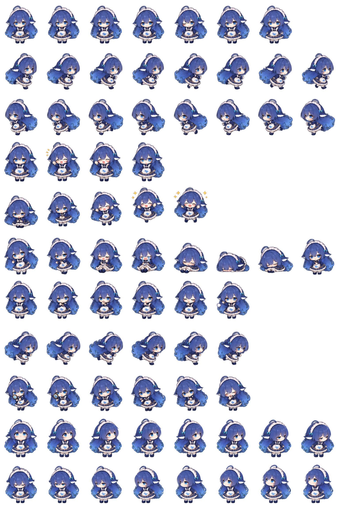

# DeepSeek Pet for Codex / DeepSeek Codex 桌面宠物

A Codex/Hatch Pet v2 package based on the supplied DeepSeek blue chibi character artwork.

基于 DeepSeek 蓝色 Q 版角色素材制作的 Codex / Hatch Pet v2 内置桌面宠物。



<details open>
<summary><strong>🇨🇳 中文说明（点击展开或收起）</strong></summary>

## 简介

这是一个适用于 Codex 内置宠物系统的 DeepSeek 动画宠物包，不是独立运行的桌面程序。宠物使用 Hatch Pet v2 图集规范，并保留了角色原有的服装、发型、配色与整体形象。

## 安装方法

下载或克隆本仓库，然后将整个仓库目录复制到：

```text
%CODEX_HOME%\pets\deepseek
```

如果 Windows 中没有单独配置 `CODEX_HOME`，通常使用：

```text
%USERPROFILE%\.codex\pets\deepseek
```

最终目录结构应为：

```text
%USERPROFILE%\.codex\pets\deepseek\
├── pet.json
└── spritesheet.png
```

复制完成后重启 Codex，然后进入 **设置 → 宠物**，选择 **DeepSeek**。

## 包含文件

- `pet.json` — Codex 自定义宠物清单。
- `spritesheet.png` — 实际使用的 RGBA 动画图集。
- `preview.png` — 带动作标签的动画预览图。
- `validation.json` — Hatch Pet 图集自动验证结果。
- `checksums.sha256` — 发布资源的 SHA-256 校验值。

## 图集规格

- `spriteVersionNumber`：2
- 图集尺寸：1536 × 2288 px
- 网格：8 列 × 11 行
- 单帧尺寸：192 × 208 px
- 标准动画：9 行
- 顺时针观察方向：16 个
- 透明像素 RGB 残留：0

## 运行机制说明

动画播放速度和状态切换由 Codex 内置宠物引擎控制。当前自定义宠物清单不支持为单个宠物设置独立 FPS、任意随机散步、夜间睡眠计划、自定义点击区域或额外交互状态。

跳跃动作特意保留了原始前五帧，使 Codex 对末帧的较长停留落在带星光的腾空姿势上，从而保留原动画清晰、轻微顿挫的起跳节奏。

</details>

<details>
<summary><strong>🇬🇧 English (click to expand or collapse)</strong></summary>

## Overview

This is a DeepSeek animated pet package for the built-in Codex pet system, not a standalone desktop application. It follows the Hatch Pet v2 atlas contract while preserving the character's original clothing, hairstyle, colors, and overall identity.

## Installation

Download or clone this repository, then copy the entire repository directory to:

```text
%CODEX_HOME%\pets\deepseek
```

When `CODEX_HOME` is not explicitly configured on Windows, the usual location is:

```text
%USERPROFILE%\.codex\pets\deepseek
```

The final installation should contain:

```text
%USERPROFILE%\.codex\pets\deepseek\
├── pet.json
└── spritesheet.png
```

Restart Codex, open **Settings → Pets**, and select **DeepSeek**.

## Package contents

- `pet.json` — Codex custom-pet manifest.
- `spritesheet.png` — production RGBA animation atlas.
- `preview.png` — labeled animation contact sheet.
- `validation.json` — deterministic Hatch Pet atlas validation result.
- `checksums.sha256` — SHA-256 checksums for the distributable assets.

## Atlas contract

- `spriteVersionNumber`: 2
- Dimensions: 1536 × 2288 px
- Grid: 8 columns × 11 rows
- Cell size: 192 × 208 px
- Standard animation rows: 9
- Clockwise look directions: 16
- Transparent RGB residue: 0 pixels

## Runtime notes

Animation timing and state transitions are controlled by the built-in Codex pet engine. The current custom-pet manifest does not support per-pet FPS, arbitrary random walking, night-time sleep schedules, custom hitboxes, or additional interaction-state registration.

The jump row intentionally preserves the first five authored poses so Codex's longer final-frame hold lands on the airborne star pose, retaining the original clear and slightly snappy jump rhythm.

</details>
