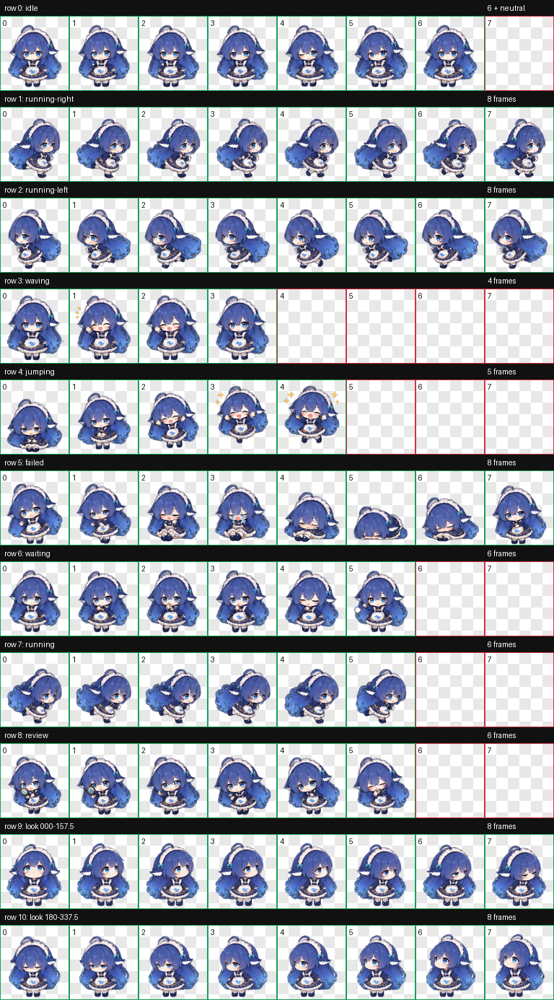

# DeepSeek Pet for Codex

A Codex/Hatch Pet v2 package based on the supplied DeepSeek blue chibi character artwork.



## Installation

Copy this entire `deepseek` directory to:

```text
%CODEX_HOME%\pets\deepseek
```

When `CODEX_HOME` is not explicitly configured on Windows, the usual location is:

```text
%USERPROFILE%\.codex\pets\deepseek
```

Restart Codex, then select **DeepSeek** under **Settings → Pets**.

## Package contents

- `pet.json` — Codex custom-pet manifest.
- `spritesheet.png` — production RGBA atlas.
- `preview.png` — labeled animation contact sheet for repository display.
- `validation.json` — deterministic Hatch Pet atlas validation result.
- `checksums.sha256` — SHA-256 checksums for the distributable assets.

## Atlas contract

- `spriteVersionNumber`: 2
- Dimensions: 1536 × 2288 px
- Grid: 8 columns × 11 rows
- Cell size: 192 × 208 px
- Standard animation rows: 9
- Clockwise look directions: 16
- Transparent RGB residue: 0 pixels

The Codex runtime owns animation timing and state transitions. Per-pet FPS, arbitrary random walking, night-time sleep schedules, custom hitboxes, and extra interaction-state registration are not supported by the current custom-pet manifest.

The jump row intentionally preserves the authored first five poses so Codex's longer final-frame hold lands on the airborne star pose, retaining the original snappy pause.
